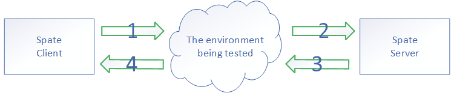

# Spate 介绍

Spate是用来产生大流量的网络性能测试工具，它可以支持TCP(伪TCP)的状态机，只是没有标准的TCP的丢包重传等。它能体现pps,延迟,Session这三者的关系。

通过Spate的延迟分布功能，用户可以轻易发现被测试环境这样的bug: 绝大多数的包是低延迟，只有个别包出现高延迟。

**特性**：

* 可配置的大pps
* 可配置的大session数量
* 可配置的brust能力
* 完整的TCP状态机支持 (伪TCP)
* 可视化的延迟及延迟分布表现
* 通过 DPDK & eBPF 来提升Spate的发包能力

## 如何编译

下载源码后，进入源码路径，输入 **make** 命令，观察其输出用于指导编译.

## Spate 原理简介

Spate的Client模式用于模拟多台机器来产生流量，Server模式通过反射数据包来模拟被访问的多台机器。

通过合理的配置配置Spate，你可以用来测试2,3层网络设备。

## 如何运行

运行 "**./spate -h**". 观察其输出用于指导如何运行。