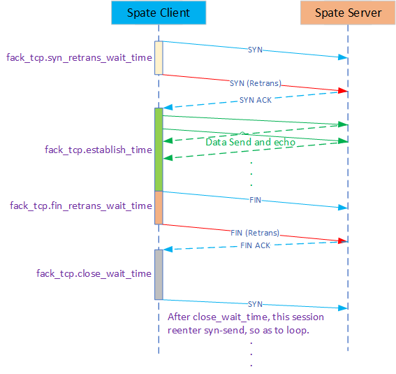

# 如何编写 spate config 文件

可以在源码路径 doc/example_config/ 下参照示例.

配置选项总体可分为3类如下

- **Client-only** config section 用于配置Client模式
- **Server-only** config section 用于配置Server模式
- **common** config section 用于配置公用模式（Client与Server都可使用）

## **Client-Only** config section

* Session config block

  | config item                   | default value | description                                                  |
  | ----------------------------- | :------------ | ------------------------------------------------------------ |
  | session.sip                   | \             | 用于生成数据包的源IP地址配置，例如     *session.sip = 192.168.101.1 (5)*  表示生成的数据包的源IP从 192.168.101.1 到 192.168.101.5 |
  | session.dip                   | \             | 类似 *session.sip* , 用于生成数据包的目的IP                  |
  | session.sport                 | \             | 用于生成数据包的源port配置，例如     *session.sport = 1000 (2)*  表示从 1000 到 1002 . |
  | session.dport                 | \             | 类似 *session.sport*, 用于生成数据包的目的port               |
  | session.proto                 | udp           | 生成数据包的协议，例如     *session.proto = tcp* 表示生成TCP报文     *session.proto = udp* 表示生成UDP报文 |
  | session.table_split_by_worker | 1             | 若设置 1, 把生成的session table按worker切分. 若设置  0, 所有的worker共享session table |
  | session.table_shuffle         | 0             | session table是否需要洗牌(随机化)                            |
  | session.table_show            | 0             | 是否打印session table                                        |

* Packet config block

  | config item            | default value | description                                       |
  | ---------------------- | :------------ | ------------------------------------------------- |
  | packet.payload_size    | 16            | 生成数据包的payload size,目前此值最小为16         |
  | wpacket.pps_per_worker | 1             | 每个worker发送多少pps(每秒每个worker发多少包)     |
  | packet.burst_len       | 0             | 发包的burst.  设置 *0* 意味着系统自适配的burst |
  | packet.dmac            | \             | 生成数据包的目的Mac                               |
  | pakcet.vlan_enable     | 0             | 生成的数据包是否需要有VLAN头                      |
  | pakcet.vlan_id         | \             | 若需要设置VLAN头，配置VLAN ID                     |

* Vxlan config block

  这个配置段用于配置vxlan，即用于模拟一些 overlay_ip 跑在一些 underlay_ip 上。发包的规则会控制1个overlay_ip一定对应1个underlay_ip，但一个underlay_ip可以对应多个overlay_ip。（可以想象成模拟20个pod跑在2个Node上，其中每个Node有10个pod）

  | config item          | default value | description                                                  |
  | -------------------- | :------------ | ------------------------------------------------------------ |
  | vxlan.enable         | 0             | 生成的数据包是否需要vxlan封装                                |
  | vxlan.vni            | \             | VNI                                                          |
  | vxlan.underlay.dmac  | \             | underlay的 目的MAC                                           |
  | vxlan.underlay.sip   | \             | Underlay的 源IP， *vxlan.underlay.sip* 必须是 *session.sip* 的整数倍 |
  | vxlan.underlay.dip   | \             | Underlay的 目的IP， *vxlan.underlay.dip* 必须是 *session.dip* 的整数倍 |
  | vxlan.underlay.sport | \             | Vxlan外层UDP的源port 例如: *vxlan.underlay.sport = 60000(128)* 意味着: 源port的范围在 [60000, 60128). |
  | vxlan.overlay.smac   | \             | Overlay的 源MAC                                              |

* Fack-TCP config block

  Fack-TCP(伪TCP)用于仿真TCP得状态，它并不支持完整的TCP，仅支持TCP的状态机，使用的典型场景：测试GW的TCP。

  | config item                    | default value | description                                                  |
  | ------------------------------ | :------------ | ------------------------------------------------------------ |
  | fack_tcp.syn_retrans_wait_time | 3             | TCP syn的重传时间（单位 ：秒， 下同）                        |
  | fack_tcp.fin_retrans_wait_time | 3             | TCP fin的重传时间                                            |
  | fack_tcp.close_wait_time       | 5             | Close后的等待时间，经过此时间后回到Idle状态，设置 *0* 意味着进入Close状态后不会再进入其他状态。 |
  | fack_tcp.establish_time        | 0             | TCP的establish状态持续时间，设置 *0* 意味着只要进入了establish，就会一直处于此状态 |
  | fack_tcp.synack_ack_enable     | 0             | 此选项设置为 1 后，Client会自动发送TCP三步握手第3包          |
  | fack_tcp.quit_graceful_timeout | 0             | 退出前发送Rst包，设置0表示不开启，此值最大60                 |

  Fack-TCP工作的状态机如下图所示：

   

## **Server-Only** config section

* Listen config block

  | config item          | default value | description                                         |
  | -------------------- | :------------ | --------------------------------------------------- |
  | server.listen.ip     | \             | 模拟监听的IP地址，仅匹配此IP的才会反射              |
  | server.listen.port   | \             | 模拟监听的port                                      |
  | server.listen.proto  | tcp,udp       | 监听的协议，设置  *tcp,udp*  意味着同时监听tcp和udp |
  | server.vxlan.enable  | 0             | Server端是否支持vxlan反射                           |
  | server.vxlan.vtep.ip | \             | 若支持vxlan反射，表示服务端的 VTEP ip address.      |

## **Common** config section

* Host config block

  | config item           | default value | description                                                  |
  | --------------------- | :------------ | ------------------------------------------------------------ |
  | host.arp_enable       | 1             | 是否对 *host.ip* 配置的IP地址做arp应答                       |
  | host.icmp_enable      | 1             | 是否对 *host.ip* 配置的IP地址做imp应答                       |
  | host.ip               | \             | 配置表示这段ip地址需要被模拟的  *host.ip = 192.168.101.1 (5)* 表示从 192.168.101.1 到 192.168.101.5 |
  | host.garp_enable      | 0             | 启动时是否需要发送garp                                       |
  | host.garp_vlan_enable | 0             | garp是否需要VLAN                                             |
  | host.garp_vlan_id     | 0             | garp的VLAN_ID                                                |

* Statistics config block

  | config item           | default value | description                  |
  | --------------------- | :------------ | ---------------------------- |
  | stat.flush_wait_time  | 1             | 统计的刷新间隔（单位：秒）   |
  | stat.worker_enable    | 0             | 统计是否输出每个worker的信息 |
  | stat.max_history_time |               | 统计记录的数据的最大时间     |

* Http config block

  | config item      | default value | description                  |
  | ---------------- | :------------ | ---------------------------- |
  | http.enable      | 0             | 是否支持Http API             |
  | http.listen_ip   | 0             | Http API server的监听IP地址  |
  | http.listen_port |               | Http API server的监听tcp端口 |
  
* Pcap config block

  | config item    | default value | description                                                  |
  | -------------- | :------------ | ------------------------------------------------------------ |
  | pcap.enable    | 0             | Does pcap enable when spate start.                           |
  | pcap.rx_enable | 0             | Does pcap enable on RX when *pcap.enable* is 1.              |
  | pcap.rx_filter |               | The filter of pcap on RX, for example: *pcap.rx_filter = ip_saddr:192.168.1 (2), tcp_sport:1000 (3)* Means If the  souce ip is from 192.168.1.1 to 192.168.1.2 And tcp souce port is from 1000 to 10003  Can meet filter criteria. |
  | pcap.tx_enable | 0             | Does pcap enable on TX when *pcap.enable* is 1.              |
  | pcap.tx_filter |               | Similar to *pcap.rx_filter* .                                |

* Plane config block

  Spate generate traffic by Linux AF_PACKET or DPDK. It abstracts Linux AF_PACKET and DPDK into different implementations with a unified interface. 

  Note: Part of the configuration of DPDK depends on the startup command line.

  * Linux plane config block

    | config item                  | default value | description                                                  |
    | ---------------------------- | :------------ | ------------------------------------------------------------ |
    | linux.netdev.name            | \             | The net device name of spate used.For example:      *linux.netdev.name = ens0f1* Means used the ens0f1 net card. |
    | linux.netdev.rx_desc         | 4096          | The count of RAW AF_PACKET rx-ring.                          |
    | linux.netdev.tx_desc         | 4096          | The count of RAW AF_PACKET tx-ring.                          |
    | linux.netdev.bypass_qdisc    | 0             | Whether the PACKET_QDISC_BYPASS is set to the raw-socket responsible for sending. Note: If you set this option, you cannot use tcpdump to capture packets,  that is, bypassing tc qdisc also bypasses the kernel packet capture. |
    | linux.worker.nr              | 1             | How many worker thread will be used.                         |
    | linux.worker.bind_cpu_enable | 0             | Does the worker thread need to bind to special cpu.          |
    | linux.worker.bind_cpu_begin  | 0             | The beginning of the cpu-id bind to worker when *linux.worker.bind_cpu_enable = 1*.For example:     *linux.worker.bind_cpu_begin=2* when *linux_worker.nr = 4* Means:       CPU 2 bind to worker 0        CPU 3 bind to worker 1        CPU 4 bind to worker 2        CPU 5 bind to worker 3 |
    | linux.socket                 | raw           | Only raw is supported now, af_xdp will be supported in the future. |
  
    eBPF offload in linux mode:
  
    If you want to use eBPF offload, please make sure you can use eBPF.
  
    | config item               | default value | description                                                  |
    | ------------------------- | :------------ | ------------------------------------------------------------ |
    | linux.ebpf.offload_enable | 0             | Enable the eBPF offload.                                     |
    | linux.ebpf.obj_path       | \             | The path where the .o file compiled by eBPF is located, the full path is required. |
  
  * DPDK plane config block
  
    If you want to use DPDK mode, please make sure you can use DPDK.
  
    | config item             | default value | description                                                  |
    | ----------------------- | :------------ | ------------------------------------------------------------ |
    | dpdk.netdev.name        | \             | The net device of PCI name of spate used.For example:     *dpdk.netdev.name = 0000:00:06.0* |
    | dpdk.netdev.rx_desc     | 4096          | The count of rx_desc of net device.                          |
    | dpdk.netdev.tx_desc     | 4096          | The count of tx_desc of net device.                          |
    | dpdk.netdev.promiscuous | 1             | Whether the network card is in promiscuous mode.             |
    | dpdk.mbuf_pool_size     | 0             | The mbuf pool size of DPDK, *0* means spate will automatically calculate this value. |

