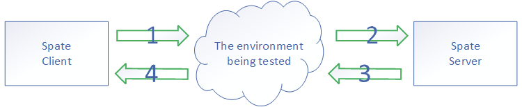

# Introduction to Spate

Spate is a traffic generate tool which can gererate large traffic with large sessions. It also support full TCP (fack tcp) state machine, but whitout lost packet retransmission. It can also be used to monitor the packet loss and latency introduced by the device which is tested.
Through the latency distribution function of spate, user can easily find the test equipment's bug of which has low latency for most data packets, but a little particular packets that introduce high latency.

**Feature**：

* A large number of adjustable pps
* A large number of adjustable sessions
* Adjustable burst capacity
* Full TCP state machine support (fack TCP)
* Visualization of average latency and latency distribution
* Improve performance through DPDK & EBPF.

## Introduction of how to build

Get this source code, enter the spate directory, get the help information of how to make by enter **make** command.

## Introduction of the working principle of spate

The client mode of spate will generate traffic that you can config it, and the server mode of spate echo the traffic of the client has sent.

Through the configuration of the spate, you can test the 2nd and 3rd layer equipment.

## Introduction of the command line startup method

See the help information for the output of the command "**./spate -h**".