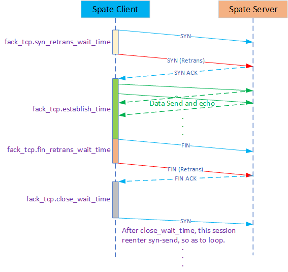

# How to write Spate config file

You can refer to the example of the config file under the source code directory doc/example_config/ .

The config item can be divided into 3 categories: 

* **Client-only** config section for client mode of spate.
* **Server-only** config section for server mode of spate.
* **common** config section for both client and server.

## **Client-Only** config section

* Session config block

  | config item                   | default value | description                                                  |
  | ----------------------------- | :------------ | ------------------------------------------------------------ |
  | session.sip                   | \             | Source IP address of the generated packet.For example:      *session.sip = 192.168.101.1 (5)*  Means the souce IP of generated packet is from 192.168.101.1 to 192.168.101.5 . Note: The range is an open interval at the front, a closed interval at the back, such as [  ). |
  | session.dip                   | \             | Similar to *session.sip* , Dest IP address of the generated packet. |
  | session.sport                 | \             | Source port of the generated packet.For example:     *session.sport = 1000 (2)*  Means the source port of generate is from 1000 to 1002 . |
  | session.dport                 | \             | Similar to *session.sport*, Dest port of the generated packet. |
  | session.proto                 | udp           | The port of the generated packet, For example:     *session.proto = tcp* Means generate tcp packet.     *session.proto = udp* Means generate udp packet. |
  | session.table_split_by_worker | 1             | If set 1, divide the session table to each worker. If set 0, all the worker use the total session table, |
  | session.table_shuffle         | 0             | Does the generated session table need to be shuffled.        |
  | session.table_show            | 0             | Does the generated session table need to be showed.          |

* Packet config block

  | config item           | default value | description                                                  |
  | --------------------- | :------------ | ------------------------------------------------------------ |
  | packet.payload_size   | 16            | The generated packet's payload size, It can not less than 16. |
  | packet.pps_per_worker | 1             | How many packets are sent per second per worker.             |
  | packet.burst_len      | 0             | The burst of the generated packet.   *0* means It Automatic adjustment of burst. |
  | packet.dmac           | \             | The dest MAC address of the generated packet.                |
  | pakcet.vlan_enable    | 0             | Does the generatend packet need vlan support.                |
  | pakcet.vlan_id        | \             | The VLAN ID of the generatend packet if need vlan support.   |

* Vxlan config block

  This config block is used to simulate some overlay_ip run on some underlay_ip. One overlay_ip can only use one underlay_ip, but one underlay_ip can carry multiple overlay_ips.

  | config item          | default value | description                                                  |
  | -------------------- | :------------ | ------------------------------------------------------------ |
  | vxlan.enable         | 0             | Whether the generated packets need vxlan encapsulation.      |
  | vxlan.vni            | \             | The vni of the generated packet encapsulated by vxlan.       |
  | vxlan.underlay.dmac  | \             | The underlay dest MAC address of the generated packet encapsulated by vxlan. |
  | vxlan.underlay.sip   | \             | The underlay of dest IP address of the generated packet encapsulated by vxlan. The count of *vxlan.underlay.sip* must be divisible by the count of *session.sip*. |
  | vxlan.underlay.dip   | \             | The underlay of source IP address of the generated packet encapsulated by vxlan. The count of *vxlan.underlay.dip* must be divisible by the count of *session.dip*. |
  | vxlan.underlay.sport | \             | The underlay of udp source port of the generated packet encapsulated by vxlan. For example: *vxlan.underlay.sprt = 60000(128)* Means: The range of the underlay udp source port is [60000, 60128). |
  | vxlan.overlay.smac   | \             | The src Mac addr of the overlay of vxlan packet.             |

* Fack-TCP config block

  Fack-TCP  is used to simulate TCP test. It does not support complete TCP, but only supports complete state machine of TCP. Typical application scenario: Used to test the connection timeout of GW to TCP.

  | config item                    | default value | description                                                  |
  | ------------------------------ | :------------ | ------------------------------------------------------------ |
  | fack_tcp.syn_retrans_wait_time | 3             | The retrans wait time(second) of the TCP syn packet.         |
  | fack_tcp.fin_retrans_wait_time | 3             | The retrans wait time(second) of the TCP fin packet.         |
  | fack_tcp.close_wait_time       | 5             | The close wait time (second) of the TCP.  After close wait time, This session goto syn-send-state.  *0* means once enter close-state, it does not switch to idle-state anymore. |
  | fack_tcp.establish_time        | 0             | The establish time(second) of the TCP.  *0* means always send TCP data packet in establish. |
  | fack_tcp.synack_ack_enable     | 0             | Is it enable to reply ack on synack to speed up the completion of the TCP three-way handshake. |
  | fack_tcp.quit_graceful_timeout | 0             | Quit gracefully when using tcp, and speed up the connection recovery of the device under test by sending RST packets. Set to 0 means not enable, the maximum does not exceed 60 (Second). |

  User can understand the fack_tcp state machine through the following figure:

   

## **Server-Only** config section

* Listen config block

  | config item          | default value | description                                                  |
  | -------------------- | :------------ | ------------------------------------------------------------ |
  | server.listen.ip     | \             | The listen ip address of server.                             |
  | server.listen.port   | \             | The listen port of server.                                   |
  | server.listen.proto  | tcp,udp       | The listen proto of server.     *tcp,udp* means both tcp and udp. |
  | server.vxlan.enable  | 0             | Does server support vxlan.                                   |
  | server.vxlan.vtep.ip | \             | The VTEP ip address of server.                               |

## **Common** config section

* Host config block

  | config item           | default value | description                                                  |
  | --------------------- | :------------ | ------------------------------------------------------------ |
  | host.arp_enable       | 1             | Does the masqueraded ip need replay arp request.             |
  | host.icmp_enable      | 1             | Does the masqueraded ip need replay icmp request.            |
  | host.ip               | \             | The ip address that needs to be masqueraded after spate startup.For example  *host.ip = 192.168.101.1 (5)* Means It masquerade from 192.168.101.1 to 192.168.101.5 |
  | host.garp_enable      | 0             | Does the masqueraded ip need send gratuitous-arp when spate start. |
  | host.garp_vlan_enable | 0             | Whether the gratuitous-arp packet need VLAN header.          |
  | host.garp_vlan_id     | 0             | If *host.garp_vlan_enable = 1* , this field is VLAN-ID.      |

* Statistics config block

  | config item          | default value | description                                               |
  | -------------------- | :------------ | --------------------------------------------------------- |
  | stat.flush_wait_time | 1             | The flush interval(seconds) of the statistics.            |
  | stat.worker_enable   | 0             | Whether the worker traffic need to display in statistics. |

* Http config block

  | config item      | default value | description                              |
  | ---------------- | :------------ | ---------------------------------------- |
  | http.enable      | 0             | Whether the http-api support.            |
  | http.listen_ip   | 0             | The ipv4 addr of http-api server listen. |
  | http.listen_port |               | The tcp port of http-api server listen.  |
  
* Pcap config block

  | config item    | default value | description                                                  |
  | -------------- | :------------ | ------------------------------------------------------------ |
  | pcap.enable    | 0             | Does pcap enable when spate start.                           |
  | pcap.rx_enable | 0             | Does pcap enable on RX when *pcap.enable* is 1.              |
  | pcap.rx_filter |               | The filter of pcap on RX, for example: *pcap.rx_filter = ip_saddr:192.168.1 (2), tcp_sport:1000 (3)* Means If the  souce ip is from 192.168.1.1 to 192.168.1.2 And tcp souce port is from 1000 to 10003  Can meet filter criteria. |
  | pcap.tx_enable | 0             | Does pcap enable on TX when *pcap.enable* is 1.              |
  | pcap.tx_filter |               | Similar to *pcap.rx_filter* .                                |

* Plane config block

  Spate generate traffic by Linux AF_PACKET or DPDK. It abstracts Linux AF_PACKET and DPDK into different implementations with a unified interface. 

  Note: Part of the configuration of DPDK depends on the startup command line.

  * Linux plane config block

    | config item                  | default value | description                                                  |
    | ---------------------------- | :------------ | ------------------------------------------------------------ |
    | linux.netdev.name            | \             | The net device name of spate used.For example:      *linux.netdev.name = ens0f1* Means used the ens0f1 net card. |
    | linux.netdev.rx_desc         | 4096          | The count of RAW AF_PACKET rx-ring.                          |
    | linux.netdev.tx_desc         | 4096          | The count of RAW AF_PACKET tx-ring.                          |
    | linux.netdev.bypass_qdisc    | 0             | Whether the PACKET_QDISC_BYPASS is set to the raw-socket responsible for sending. Note: If you set this option, you cannot use tcpdump to capture packets,  that is, bypassing tc qdisc also bypasses the kernel packet capture. |
    | linux.worker.nr              | 1             | How many worker thread will be used.                         |
    | linux.worker.bind_cpu_enable | 0             | Does the worker thread need to bind to special cpu.          |
    | linux.worker.bind_cpu_begin  | 0             | The beginning of the cpu-id bind to worker when *linux.worker.bind_cpu_enable = 1*.For example:     *linux.worker.bind_cpu_begin=2* when *linux_worker.nr = 4* Means:       CPU 2 bind to worker 0        CPU 3 bind to worker 1        CPU 4 bind to worker 2        CPU 5 bind to worker 3 |
    | linux.socket                 | raw           | Only raw is supported now, af_xdp will be supported in the future. |
  
    eBPF offload in linux mode:
  
    If you want to use eBPF offload, please make sure you can use eBPF.
  
    | config item               | default value | description                                                  |
    | ------------------------- | :------------ | ------------------------------------------------------------ |
    | linux.ebpf.offload_enable | 0             | Enable the eBPF offload.                                     |
    | linux.ebpf.obj_path       | \             | The path where the .o file compiled by eBPF is located, the full path is required. |
  
  * DPDK plane config block
  
    If you want to use DPDK mode, please make sure you can use DPDK.
  
    | config item             | default value | description                                                  |
    | ----------------------- | :------------ | ------------------------------------------------------------ |
    | dpdk.netdev.name        | \             | The net device of PCI name of spate used.For example:     *dpdk.netdev.name = 0000:00:06.0* |
    | dpdk.netdev.rx_desc     | 4096          | The count of rx_desc of net device.                          |
    | dpdk.netdev.tx_desc     | 4096          | The count of tx_desc of net device.                          |
    | dpdk.netdev.promiscuous | 1             | Whether the network card is in promiscuous mode.             |
    | dpdk.mbuf_pool_size     | 0             | The mbuf pool size of DPDK, *0* means spate will automatically calculate this value. |

